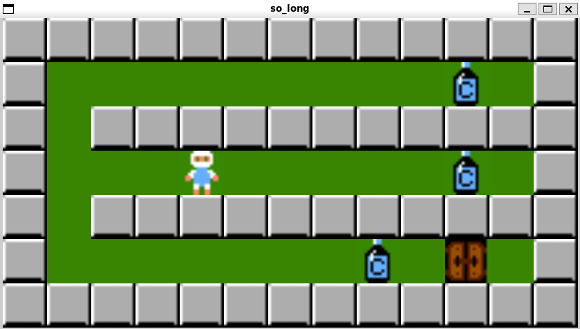

# So Long

**So Long** é um jogo desenvolvido no ambiente da **Ecole 42** como parte do projeto de programação. O jogo é uma implementação simples de um jogo de labirinto onde o jogador precisa coletar itens e alcançar a saída, tudo isso enquanto explora um mapa gerado com base em um arquivo `.ber`.

## Descrição

O objetivo do jogo é controlar um personagem que deve coletar itens (representados pelas letras 'C') e alcançar a saída (representada pela letra 'E'). O mapa é uma grade, composta por paredes (representadas por '1'), espaços vazios (representados por '0') e elementos necessários ('P' para o jogador, 'C' para os colecionáveis e 'E' para a saída).

Durante o jogo, o personagem pode se mover pelas teclas de direção (W, A, S, D) e deve garantir que todos os itens estejam acessíveis no mapa antes de alcançar a saída. Caso contrário, o jogo será encerrado com uma mensagem de erro.

## Funcionalidades

- **Jogador**: O jogador começa no ponto 'P' e pode se mover pelas teclas W (para cima), A (para a esquerda), S (para baixo) e D (para a direita).
- **Colecionáveis**: O jogador deve coletar todos os itens (letras 'C') para poder alcançar a saída.
- **Saída**: Após coletar todos os itens, o jogador pode alcançar a saída (letra 'E').
- **Validação do mapa**: O programa verifica se o mapa está de acordo com os requisitos (retângulo, paredes ao redor, elementos necessários e acessibilidade).
- **Erros**: Mensagens de erro serão exibidas se o mapa não for válido ou se o jogador não conseguir acessar todos os elementos necessários.

## Requisitos

- **MinilibX**: A biblioteca gráfica MiniLibX é utilizada para a criação e manipulação da interface gráfica do jogo.

## Como jogar

1. Importe a biblioteca MiniLibX:

   ```bash
   git clone https://github.com/42Paris/minilibx-linux.git
2. Após clonar a biblioteca rode o Makefile da biblioteca:

   ```bash
   cd minilibx-linux
   make
3. Após esse processo, o jogo tá pronto para ser compilado da seguinte maneira:
```bash
cd ..
make
./so_long [mapa.ber]

```
O arquivo de mapa (mapa.ber) deve ser um arquivo que contenha o mapa do jogo, onde:

- 'P' representa o ponto de início do jogador.
- 'C' representa um item colecionável.
- 'E' representa a saída.
- '1' representa uma parede.
- '0' representa um espaço vazio.

## Validação do Mapa

O programa verifica automaticamente a validade do mapa antes de iniciar o jogo. Caso o mapa não seja válido, uma mensagem de erro será exibida e o jogo será encerrado.

Os critérios de validação incluem:
- O mapa deve ser um retângulo.
- O mapa deve estar cercado por paredes.
- O mapa deve conter pelo menos um jogador ('P'), um item colecionável ('C') e uma saída ('E').
- Todos os itens e a saída devem ser acessíveis a partir do ponto de início.

## Estrutura do Projeto

```bash
├── Makefile            # Arquivo de construção
├── README.md           # Este arquivo
├── so_long.h           # Cabeçalhos e declarações
├── src/                # Código-fonte
│   ├── check_map.c     # Funções auxiliares para verificar a validade do mapa e suas condições iniciais
│   ├── dfs.c           # Funções de busca em profundidade para validação do mapa
│   ├── erro.c          # Funções auxiliares para exibição e manipulação de mensagens de erro
│   ├── events.c        # Funções relacionadas ao tratamento de eventos no jogo (movimentos, interações)
│   ├── game.c          # Funções principais relacionadas à lógica geral do jogo
│   ├── gnl.c           # Implementação da função get_next_line para leitura de arquivos
│   ├── main.c          # Ponto de entrada do programa, inicializa o jogo e organiza os componentes
│   ├── map.c           # Funções para manipulação e validação do mapa do jogo
│   ├── render.c        # Funções responsáveis por renderizar elementos gráficos na tela
│   └── utils.c         # Funções auxiliares para operações diversas
└── maps/               # Mapas de exemplo
    ├── map_valid.ber   # Exemplo de mapa válido
    ├── map_invalid.ber # Exemplo de mapa inválido
    └── map_large.ber   # Exemplo de mapa grande
```

## Screenshots

Aqui está uma prévia do jogo em funcionamento:


